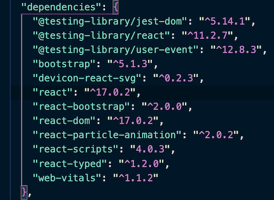
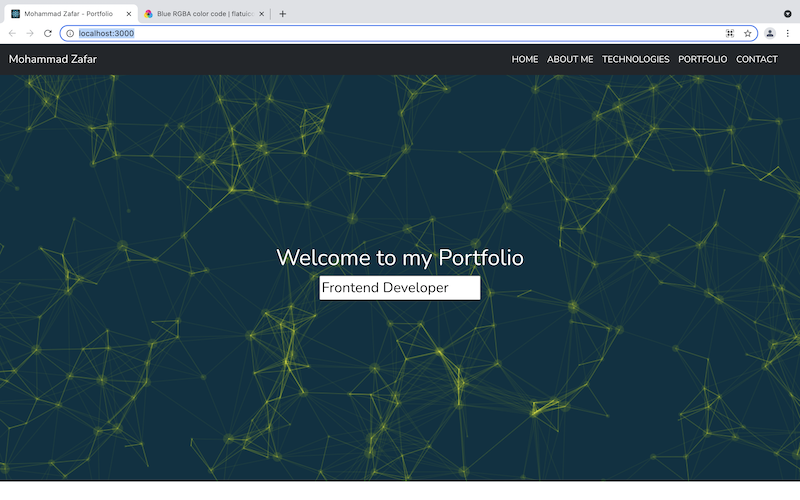
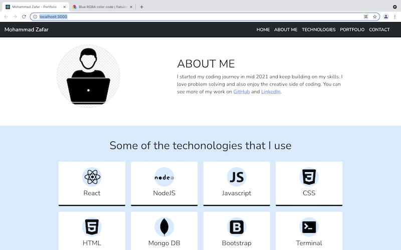
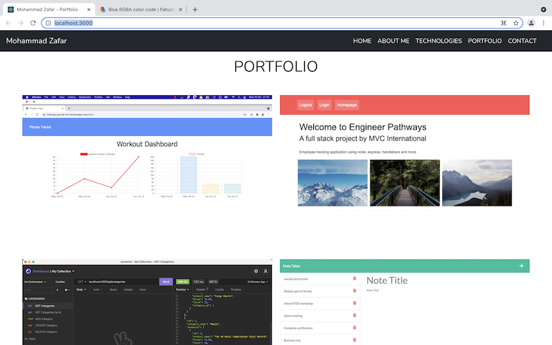
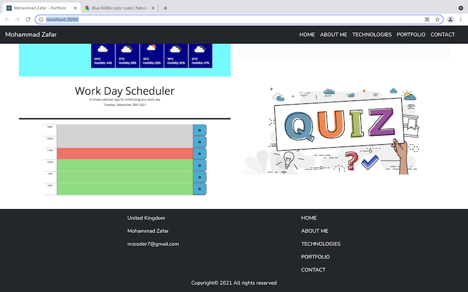

# React Portfolio

## Deployed link

View the live application here: https://react-display.herokuapp.com/

## Overview

For this project I used [Create React App](https://github.com/facebook/create-react-app) and a few different npm packages to build a responsive portfolio with React.

## New Tech Used

[React-particle-animation](https://www.npmjs.com/package/react-particle-animation) - for the background animation at the top of the page.

[React-typed](https://www.npmjs.com/package/react-typed) - to create the looping text / transition effect.

[React-bootstrap](https://www.npmjs.com/package/react-bootstrap) - incorporating Bootstrap with React.

[Devicon-react-svg](https://www.npmjs.com/package/devicon-react-svg) - rendering inline SVG icons to represent technologoies.

## Instructions

To run app locally:

1. Download or clone this repo and navigate to the app in your terminal.
2. Run `npm i` to install these dependencies:
   
3. Run `npm start` to start the server on `localhost:3000`.

## Screenshots

